# Auditoría de Seguridad en Redes Inalámbricas

## Entornos WEP, WPA/WPA2, WPS y Evil Twin


## Introducción

Para la realización de este laboratorio técnico, se ha dispuesto de un escenario controlado compuesto por un router configurado específicamente para pruebas y una máquina operativa que actúa como servidor. El objetivo es ejecutar los flujos de trabajo en un entorno seguro y aislado.

El procedimiento se basa principalmente en la suite clásica Aircrack-ng, desglosando cada ataque paso a paso para comprender a fondo los mecanismos de vulnerabilidad en lugar de recurrir únicamente a herramientas completamente automatizadas.

## Requisitos previos

- Instalación de la suite completa Aircrack-ng.
- Punto de acceso WiFi de pruebas en un entorno controlado.
- Tarjeta de red compatible con inyección de paquetes y modo monitor.

## Configuración del Modo Monitor

```bash
sudo airmon-ng start wlan0
```

> **Nota:** Al activar este modo, la tarjeta de red suele renombrarse de manera automática (por ejemplo, a `wlan0mon` o mantenerse como `wlan0` según el entorno).

## 1. Auditoría sobre el Protocolo WEP
### Fundamento Técnico y Ataque

El cifrado **WEP** (Wired Equivalent Privacy) presenta graves deficiencias estructurales. Su debilidad reside en que adjunta la clave de seguridad en el encabezado de cada paquete encapsulada en un vector de inicialización (IV) de apenas 24 bits. Debido a esta longitud tan reducida, capturar un volumen alto de tráfico permite deducir la clave mediante análisis estadístico sin necesidad de capturar un **(handshake)**.

**Paso 1**: Escaneo general de redes disponibles para identificar objetivos WEP.

```bash
sudo airodump-ng --band abg wlan0
```

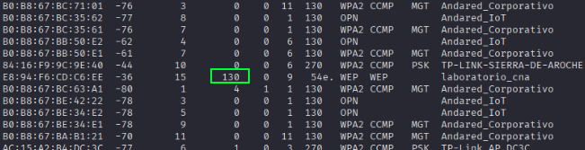

El tráfico es suficiente por lo que procedemos a sniffear el tráfico de la red.

**Paso 2**: Filtrado y captura dirigida hacia el objetivo seleccionado para recolectar IVs. Observamos la columna **#Data** hasta acumular un tráfico representativo (se recomiendan entre 20,000 y 50,000 paquetes).

```bash
airodump-ng --channel 3 --bssid E8:94:F6:CD:C6:EE --write laboratorio_cna
```

Esperaremos a que llegue al menos a **20.000** o **50.000**

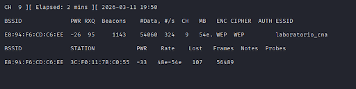

**Paso 3**: Descifraremos la cotraseña en una nueva terminal en paralelo.

```bash
sudo aircrack-ng captura_wep-01.cap
```

Una vez lanzado, nos damos cuenta que nos aparecera como resultado **KEY FOUND!**, el cual si nos fijamos veremos la contraseña.

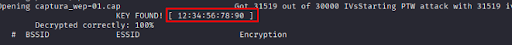

## 2. Auditoría sobre el Protocolo WPA/WPA2 (Método Handshake)
### Fundamento Técnico y Ataque

A diferencia de WEP, las redes con seguridad WPA/WPA2 basadas en claves compartidas (PSK) no exponen la contraseña directamente en el tráfico habitual. Para auditar este entorno, es necesario capturar el WPA Handshake (el proceso de autenticación de 4 vías que ocurre cuando un cliente legítimo se asocia al punto de acceso). Si no hay conexiones nuevas en ese momento, se puede forzar temporalmente la desautenticación de un cliente.

Nos vamos centrar en la siguiente red:

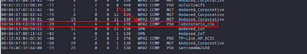

**Paso 1**: Escaneo específico del objetivo para monitorizar clientes conectados.

```bash
airodump-ng -c 9 --bssid E8:94:F6:CD:C6:EE -w captura_lab wlan0
```

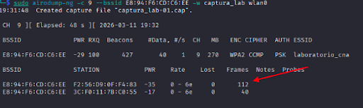

**Paso 2**: En otra terminal enviamos tramas de desautenticación dirigidas a la estacion identificada para provocar su reconexión automática.

```bash
sudo aireplay-ng -0 10 -a E8:94:F6:CD:C6:EE -c 3C:F0:11:7B:C0:55 wlan0
```

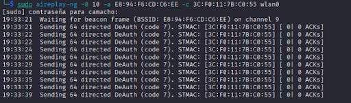

**Paso 3**: Confimación de la captura del handshake en la parte superior derecha de la interfaz de monitorización.

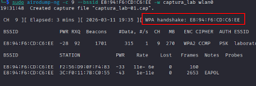

**Paso 4**: Ataque de diccionario contra el archivo `.cap` que hemos obtenido.

```bash
sudo aircrack-ng -w /usr/share/wordlists/rockyou.txt captura_lab-01.cap
```

Resultado:

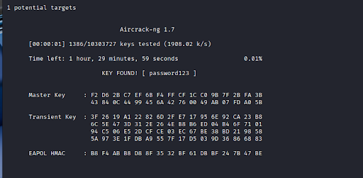

## 3. Explotación de debilidades en WPS (Vulnerabilidad PMKID / Pixie-Dust)
### Fundamento Técnico y Ataque

El estándar **WPS** (Wi-Fi Protected Setup) se diseñó para facilitar la conexión de dispositivos, pero introduce serios vectores de ataque. En esta sección se evalúa cómo extraer la clave WPA2-PSK explotando deficiencias en el intercambio de mensajes de gestión, aprovechando que el punto de acceso transmite el identificador **PMKID**.

**Paso 1**: Detección de puntos de acceso locales con soporte WPS activo mediante la herramienta `wash`.

```bash
sudo wash -i wlan0
```

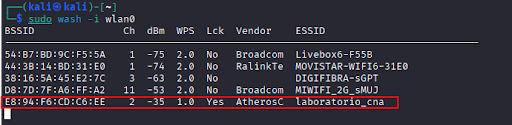

> **Nota**: Aunque el router reporte un estado de `WPS Lock: Yes`, la auditoría resulta efectiva recurriendo a técnicas como **MAC Spoofing** complementadas con el método **Pixie-Dust**.

**Paso 2**: Uso de la herramienta avanzada `wifite` automatizando la recolección del **PMKID** y la ejecución de la prueba por fuerza bruta.

```bash
sudo wifite --wps --pixie
```

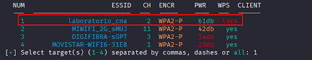

Una vez tengamos el objetivo claro, podemos lanzar el ataque. Pulsamos `CTRL + C` para detener el proceso de escaneo e introducimos el número de la red que queremos atacar.

Wifite detectó que el router enviaba el **PMKID** en sus paquetes de gestión. Esto es una vulnerabilidad de **RSN** (Robust Security Network).

Una vez obtenido el **PMKID**, el programa lanzó un ataque de diccionario.

Como la contraseña era débil (`password123`), el sistema la encontró por fuerza bruta.

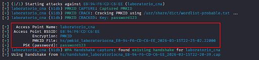

Panel de configuración web del router que valida que la contraseña recuperada coincide:

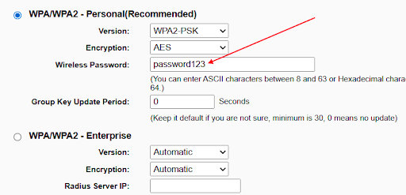

## 4. Ingeniería Social y Despliegue de Evil Trust (Rogue AP)
### Fundamento Técnico y Ataque

**¿EvilTrust?**
EvilTrust es una herramienta ofensiva para robar los datos de acceso de un usuario. La herramienta se encarga de manera automatizada de desplegar un Rogue AP, esperando clientes que se asocien a este para conseguir el ataque.

Hay que decir que el objetivo principal no es el de un ataque Evil Twin, ya que la finalidad de este no es obtener la contraseña de una red inalámbrica, sino los **datos privados del cliente** que se asocie a un punto de acceso.

Además cuenta con plantillas preconfiguradas, que vienen acompañadas de plantillas de 2FA (Segundo Factor de Autenticación), pudiendo atacar a este vector por si el usuario dispone de esta medida.

**Paso 1**: Preparación del entorno operativo e instalación de dependencias base de red y servidor web local.

```bash
sudo apt update && sudo apt install php dnsmasq hostapd nmcli -y
```

**Paso 2**: Clonación del respositorio oficial y ejecución del script principal.

```bash
git clone https://github.com/s4vitar/evilTrust.git
cd evilTrust && chmod +x evilTrust.sh
sudo ./evilTrust.sh
```

Una vez ejecutado seguiremos el asistente de la herramienta.

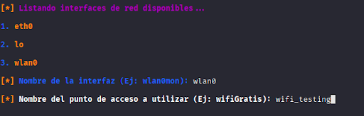

Para este laboratorio hemos llamado al punto de acceso (AP) `wifi_testing`.

**Paso 3**: Intercepción del dispositivo víctima al conectarse al nuevo punto de acceso abierto generado.

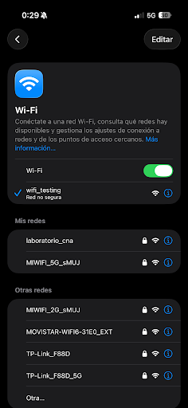

**Paso 4**: Redirección automática de la víctima al portal cautivo que emula un formulario legítimo de inicio de sesión (Google Login).

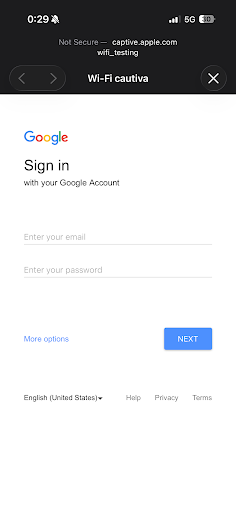
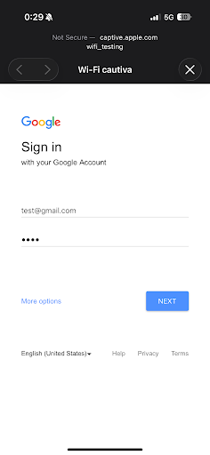

**Paso 5**: Visualización en tiempo real desde la consola del auditor técnico.

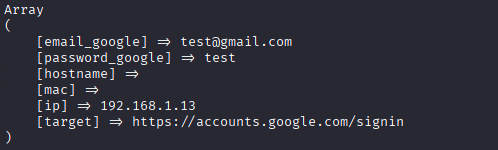

**Paso 6**: Gestión avanzada de **Bypass 2FA**. El portal cautivo solicita de manera dinámica el código temporal recibido por SMS para permitir el acceso definitivo del atacante.

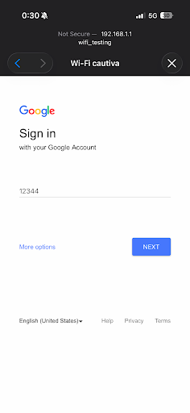

Resultado final y captura del token 2FA en la consola de evilTrust:

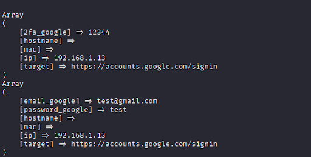


